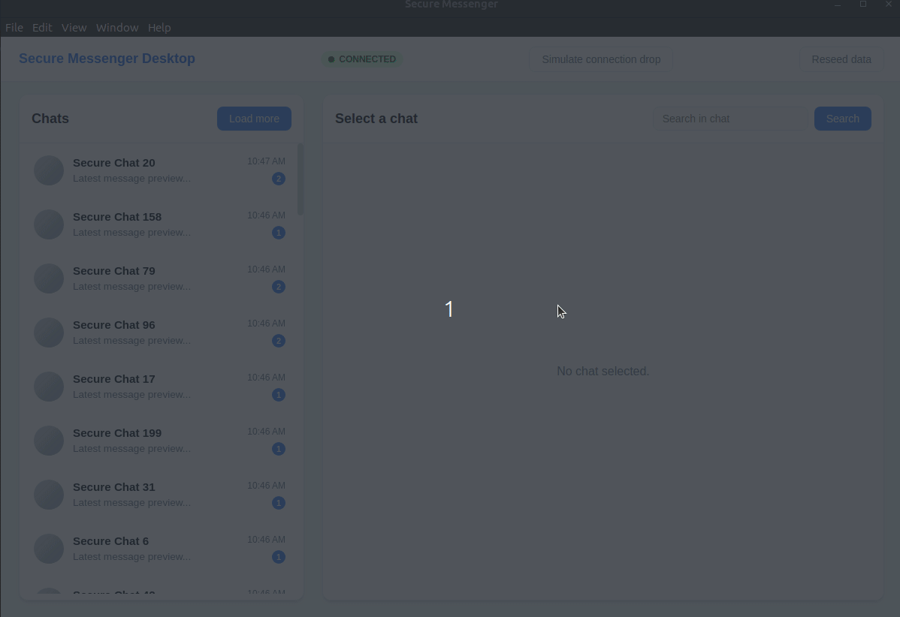

# Secure Messenger Desktop (Electron + React + TypeScript)

A small Electron app that simulates a secure messenger client with local SQLite storage, a WebSocket sync simulator, and a virtualized chat list.



## Setup & Run

```bash
npm install
npm run dev
```

### Build

```bash
npm run build
```

## Architecture Overview

**Main process (Electron)**

- `electron/main.ts`: bootstraps the app, wires IPC handlers, and starts the WebSocket server.
- `electron/db.ts`: SQLite data layer using `better-sqlite3` (schema creation, indexes, paginated queries, seeding).
- `electron/wsServer.ts`: local WebSocket server that emits `new-message` events every 1–3 seconds.

**Renderer (React + Redux Toolkit)**

- `src/renderer/App.tsx`: main UI orchestration, chat selection, search, and sync controls.
- `src/renderer/store/*`: Redux Toolkit slices for chats, messages, and connection state.
- `src/renderer/components/*`: chat list (virtualized), messages view, and connection indicator.
- `src/renderer/services/syncClient.ts`: WebSocket client with heartbeat, reconnect backoff, and message handling.
- `src/renderer/services/securityService.ts`: placeholder boundary for encrypt/decrypt calls.

**Data flow**

1. Renderer uses IPC (`window.secureApi`) to query SQLite (pagination + search).
2. WebSocket server emits `new-message` events.
3. Renderer client writes messages into SQLite through IPC, Redux updates UI, and the chat list is refreshed via IPC events.

## Trade-offs & Next Steps

- **Rendering**: Message list virtualization is not implemented (only chat list is virtualized). It can be added with `react-window` or `react-virtuoso`.
- **Sync**: The sync loop is intentionally simple; a real app would use sequence IDs and conflict resolution.
- **Security**: Messages are stored in plaintext and encrypted boundaries are placeholders. A production version would encrypt bodies at rest and in transit.
- **Testing**: No automated tests yet; next steps would include unit tests for the DB query layer and connection reducer.

## Security Hygiene

- A `SecurityService` module is included to define the boundary for encryption/decryption in a real system.
- Message bodies are never logged to the console to avoid accidental leaks.
- A production system should enforce encrypted storage, redact sensitive payloads from telemetry/logs, and harden crash dumps/devtools exposure.

## Recent Improvements

- **UI/UX Overhaul**: Completely redesigned interface with modern color palette (Slate & Blue), responsive layout, and polished components.
- **Auto-scroll**: Message view now automatically scrolls to the latest message.
- **Stability**: Fixed preload script issues and added graceful error handling for initializing the app.
- **Performance**: Optimized list rendering and connection status updates.

## SQLite Notes

- Tables: `chats(id, title, lastMessageAt, unreadCount)` and `messages(id, chatId, ts, sender, body)`.
- Indexes: `chats(lastMessageAt)` and `messages(chatId, ts)` to support pagination and sorting.
- All list views use SQL pagination and never load the full messages table into memory.
